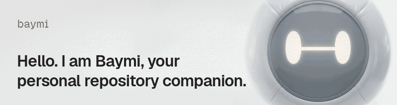

<p align="center">
  <picture>
    <source media="(prefers-reduced-motion: reduce)" srcset="./brand/banner.png">
    
  </picture>
</p>

# Baymi

[](https://github.com/PunGrumpy/baymi/actions/workflows/ci.yml) [](https://eve.dev) [](./LICENSE)

**Hello. I am Baymi, your personal repository companion.**

A backlog nobody reads is not a backlog. It’s a wish list. Issues arrive, the ones that matter sink under the ones that don’t, and on Monday you either triage from scratch or you don’t triage at all.

Baymi reads it for you. Every Monday at 09:00 UTC it posts a digest of each repository’s open issues to Slack, grouped by what needs attention, what moved this week, and what has gone quiet. Reply in the thread and it does the work:

```text
#maintainers                                           Monday, 09:00 UTC

baymi   Weekly issues digest: PunGrumpy/baymi, August 17 2026
        12 open, 3 opened this week, 2 closed. Windows CI is the theme.

        Needs attention
        #41  Flaky test on Windows: two users confirmed on 3.2, no owner yet.
        #38  Connector setup unclear: reporter went quiet after a repro request.

        Stale
        #12  Custom digest cadence: no activity in 47 days.

        Reply here to act, for example "create Linear issues for #41 and #38".

you     create Linear issues for #41 and #38 and assign them to me

baymi   Created ENG-102 for #41 and ENG-103 for #38, both assigned to you.
        linear.app/acme/issue/ENG-102
        linear.app/acme/issue/ENG-103
```

## Between digests

The digest is the loop Baymi is built around. It works the repository the rest of the week too:

- **A pull request opens**: one orienting summary comment, so a reviewer knows what changed before opening the diff. Bots are skipped
- **An @mention on an issue or pull request**: answered in the thread, if the commenter is an owner, member, or collaborator
- **An issue delegated to it in Linear**: worked as an Agent Session, and it can deliver the answer as a Slack direct message
- **A question in Slack**: answered in the direct message, the mention, or a thread it is already working in

## Surfaces

Each surface is one eve channel, and each channel is one route:

| Surface | Route | What triggers it |
| --- | --- | --- |
| GitHub | `/eve/v1/github` | `@baymiai` from an owner, member, or collaborator; a newly opened pull request |
| Linear | `/eve/v1/linear` | An Agent Session: delegate an issue or mention the agent |
| Slack | `/eve/v1/slack` | A direct message, an @mention, a follow-up in a thread it is already working in, or a reply in the digest thread |
| HTTP | `/eve/v1/session` | The direct API, which `eve dev` and the tests use |

## Requirements

- [Bun](https://bun.sh)
- A Vercel account with the [Vercel CLI](https://vercel.com/docs/cli) authenticated (`vercel login`)
- An Anthropic API key, or a token for any Anthropic-compatible endpoint you set as `ANTHROPIC_BASE_URL`

## Setup

Five steps take you from a clone to a deployment that answers on all three surfaces.

### 1. Install and link

```bash
bun install
vercel link
vercel env pull
```

`vercel env pull` writes `.env.local`, which holds the project’s variables and a short-lived OpenID Connect (OIDC) token. That token is what authenticates Vercel Blob locally.

### 2. Fill in the environment

Copy `.env.example` to `.env` and set every variable. `agent/lib/env.ts` declares and validates all of them, and none of them carries a fallback: a missing or malformed value fails discovery with one report naming every problem, instead of surfacing later as an opaque failure.

### 3. Provision the connectors

Every channel reads its credentials from a [Vercel Connect](https://vercel.com/docs/connect) connector, so this repository holds no app private keys, bot tokens, or webhook secrets. Create one connector per surface and point its trigger at that surface’s eve route:

```bash
vercel connect create github --triggers
vercel connect detach your_connector_uid_here --yes
vercel connect attach your_connector_uid_here --triggers \
  --trigger-path /eve/v1/github --yes
```

Repeat for `linear` (`--trigger-path /eve/v1/linear`) and `slack` (`--trigger-path /eve/v1/slack`). Detaching before attaching is what makes this work: `create` provisions the trigger at Connect’s default path, which eve does not serve. Put each connector’s UID in the matching `GITHUB_CONNECTOR`, `LINEAR_CONNECTOR`, and `SLACK_CONNECTOR` variable.

The Slack connector needs more than the defaults:

- **Bot scopes**: add `chat:write`, `im:write`, and `users:read.email`, which the `send_slack_dm` tool needs to answer “DM me a summary” from a Linear session
- **Trigger event types**: add `message.channels` and the `channels:history` bot scope, so a reply in the digest thread reaches the agent without a second mention. Private channels need `message.groups` and `groups:history` as well

eve ships guided flows (`bun x eve add channel/github`, `bun x eve add linear`, `bun x eve integration setup slack`) that provision the same things. Each one rewrites the channel file afterwards, which discards the customizations in `agent/channels/`: the commenter trust gate and pull request hook in `github.ts`, the requester context in `linear.ts`, and the subscription policy in `slack.ts`. Back those files up before running a guided flow, or use the manual sequence above.

### 4. Pick the repositories and the digest channel

List the repositories the digest covers in `DIGEST_REPOS`, comma separated, as `owner/repo`. Each one gets its own digest in its own thread, so an issue number in a reply means exactly one issue.

Then create or choose the Slack channel those digests post to, invite the bot to it, and put the conversation ID in `DIGEST_SLACK_CHANNEL`. Slack shows the ID, which starts with `C`, at the bottom of **Channel details**.

### 5. Deploy, then install the apps

```bash
bun x eve deploy
```

Open each connector in the Connect dashboard and install its app where it should run: the GitHub App on the repository’s org or account, the Linear app in the workspace, and the Slack app in the workspace.

## Local development

```bash
bun run dev
```

This runs the same runtime in a terminal UI. The webhook surfaces need a deployment to receive events, so drive the agent through the terminal UI instead. Schedules do not fire on cadence in dev, so trigger the digest by hand:

```bash
curl -X POST http://localhost:2000/eve/v1/dev/schedules/weekly-digest
```

eve does not load `.env` during discovery, so pass it explicitly when you run the CLI outside the dev terminal UI:

```bash
env $(grep -v '^#' .env | grep -v '^$' | xargs) bun x eve info
```

`bun run validate` typechecks and runs discovery diagnostics together, and discovery has to come back with 0 errors and 0 warnings. `bun run test` covers the logic under `agent/lib/`. `bun run eval` scores the agent against a live model and costs real money. The rest are in `package.json`.

## Where the code lives

- [ARCHITECTURE.md →](./ARCHITECTURE.md) every capability under `agent/`, which eve discovers from the filesystem rather than from a registry
- [Capability placement →](./docs/capability-placement.md) where a new tool, connection, skill, schedule, or subagent belongs
- [Notes →](./docs/notes.md) runtime behaviour that cost time to discover, worth reading before debugging something that looks impossible
- [Brand assets →](./brand/README.md) the logo, the banner, and the generator behind it

Built on the [eve](https://eve.dev) agent framework, and started as a port of [`vercel-labs/kody-eve-template`](https://github.com/vercel-labs/kody-eve-template).

[MIT-licensed](./LICENSE)
